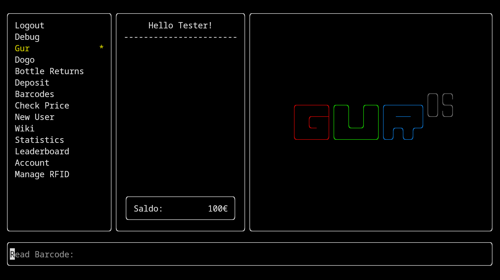

# rv-tui-frontend



## Setup

### Prerequisites

- install `node` and `npm`
- install, configure and start [`rv-backend`](https://github.com/TKOaly/rv-backend)

### Install

```bash
$
git clone git@github.com:TKOaly/rv-tui-frontend.git
cd rv-tui-frontend
npm install
```

Copy `.env.example` to `.env` and modify it to your environment

### Development

Start the build and and UI processes in parallel

```bash
$ npm run build:watch
---
$ npm run start:watch
```

Or in one command (compiler errors not visible)

```bash
$ npm run dev
```

### Building

```bash
$
npm run build
npm link
rv
```

`rv` is available globally and thus requires environment variables to be set for backend connection.

## Project structure

The project uses [`ink`](https://github.com/vadimdemedes/ink) to turn React JSX into a terminal UI code.
Styling and layout are unconventional but hooks and other main react features work as normal.

Local state management should be kept at a minimum for maintainability and panels/views/layouts should mosty handle their own state.
[`Jotai`](https://jotai.org/docs/core/use-atom) is used for atomic states where abolutely necessary. [`React Query`](https://tanstack.com/query/latest/docs/framework/react/overview#enough-talk-show-me-some-code-already) should be used to handle server state and a lot of the stage management can be relegated to it.

Good API documentation can be built from the backend's OpenApi spec e.g. with an IDE extension.

```
src
├──ui
│  ├──panels
│  ├──components
│  ╰──prompts
│
├──state
│
├──queries
│  ├──admin
│  ╰──user
│
╰──lib
```

### panels

Houses the layouts/panels/views of the application. Most of the state management and data querying should be done inside these components.

### components

Reusable, headless and more general components go here. They shouldn't do any data fetching and only handle state for contained functionality like scrolling.

### prompts

ASCII art etc. for backgrounds, debt nag prompts or easter eggs.

### state

Contains application state that has to be handled locally. Jotai is used to hopefully keep the state simple and avoid larger and complicated state structures. Local state management is mandatory for e.g. navigation but all state related to user or product data should be handled in [queries](#queries) or inside their respective UI panel components.

### queries

Queries and hooks for fetching data. Both fetch calls and react queries can live here.
The queries are divided in admin and user queries; both requiring different authentication for access.

See the [Backend](https://github.com/TKOaly/rv-backend) OpenApi [spec](https://github.com/TKOaly/rv-backend/blob/develop/openapi.yaml) for available endpoints.

### lib

Contains miscellaneous application logic and utility functions.

## Tests

Will be implemented once the codebase is not horribly unstable.

## Code Style

Linting with IDE extensions or NPM scripts, eslint and prettier config are included in the project.
